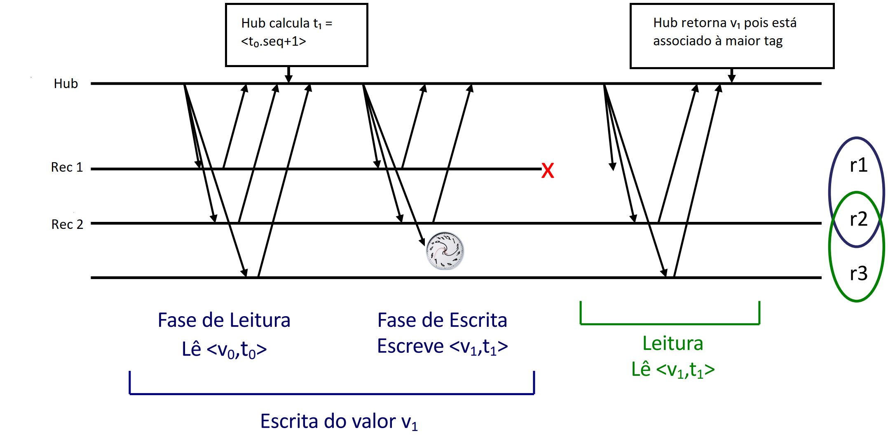
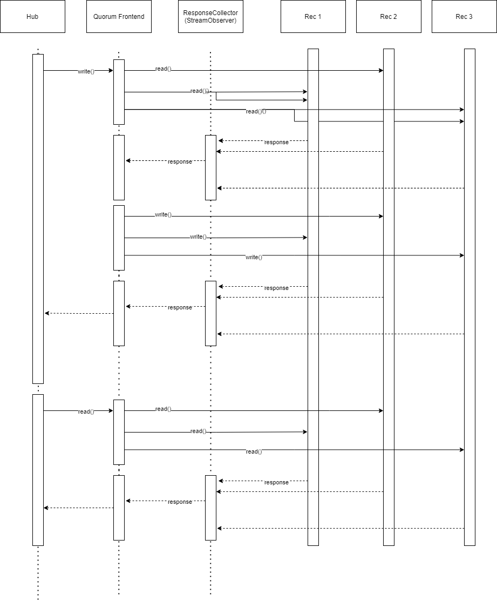

# Relatório do projeto *Bicloin*

Sistemas Distribuídos 2020-2021, segundo semestre

## Autores

**Grupo T37**

| Número | Nome              | Utilizador                                   | Correio eletrónico                  |
| -------|-------------------|----------------------------------------------| ------------------------------------|
| 93745  | Pavle Arandjelovic  | <https://git.rnl.tecnico.ulisboa.pt/ist193745> | <mailto:pavle.arandjelovic@tecnico.ulisboa.pt>   |
| 93693  | Bernardo Mota       | <https://git.rnl.tecnico.ulisboa.pt/ist193693> | <mailto:bernardo.mota@tecnico.ulisboa.pt>  |
| 93690 | António Elias | <https://git.rnl.tecnico.ulisboa.pt/ist193690> | <mailto:antonio.elias@tecnico.ulisboa.pt> |

  

## Melhorias da primeira parte

- [Corrige bugs da app com coordenadas](https://git.rnl.tecnico.ulisboa.pt/SD-20-21-2/T37-Bicloin/commit/d680c0b2d584500badb87b4a7e4271652ad937cf)
- [Melhor sincronização no hub](https://git.rnl.tecnico.ulisboa.pt/SD-20-21-2/T37-Bicloin/commit/85c551940ccce6061fb0e02619a0ee40b930f328)
- [Falhas fatais terminam o processo em vez de apenas imprimir o erro](https://git.rnl.tecnico.ulisboa.pt/SD-20-21-2/T37-Bicloin/commit/dbd72211e6f5181f5f5dc70361b20afedacc8b24)

*Estes commits não contêm todas as alterações relativas a estas melhorias, são apenas os commits mais explicativos das 
diferenças.*

## Modelo de faltas

- O sistema é assíncrono e a comunicação pode omitir mensagens; 
  
- Os gestores de réplica podem falhar silenciosamente, mas não arbitrariamente, i.e., não há falhas bizantinas;

- No máximo, existe uma minoria de gestores de réplica do rec em falha em simultâneo;

- As falhas das réplicas do rec são transientes e não definitivas;

- Por simplificação, assume-se que o hub não falha durante o processamento de procedimentos remotos, i.e., não deixa 
  procedimentos inacabados;

- Embora o conjunto de gestores de réplica seja estático, os seus endereços não são conhecidos a priori e podem variar 
 ao longo do tempo. As réplicas devem ser descobertas através do serviço de nomes. Por simplificação, não é necessário 
  tolerar a falta do ZooKeeper.
  

## Solução

### Leitura:
- A leitura começa por enviar um pedido de leitura não para todas as réplicas do rec.
- Em seguida espera por respostas suficientes para garantir a coerência dos dados e seleciona a que tem o número de 
  versão maior para devolver.
  
### Escrita:
- A escrita começa por fazer uma leitura como indicado em cima, mas em vez de receber o valor do registo recebe a sua 
  versão.
  
- Em seguida envia pedidos de escrita para todas as réplicas com o número de versão superior ao que recebeu da leitura.

- Por fim espera por *acks* suficientes antes de retornar para garantir a coerência.

## Protocolo de replicação

### Escolha do número necessário para quorum:
Caso não sejam dados valores pelo utilizador são usados tanto para a leitura como para a escrita o número 
`numRéplicas / 2 + 1` uma vez que assim é garantida a coerência entre pedidos visto que há sempre pelo menos uma 
réplica em comum entre chamadas diferentes

### *Wait-Notify*
Para as chamadas remotas do read e do write nos recs usamos stubs não bloqueantes de modo que se possa enviar os 
pedidos em simultâneo para todas as réplicas e em seguida fica à espera usando um observer do número de respostas 
necessário para continuar a operação. Usamos as primitivas *wait-notify* para permitir que isto aconteça.

## Opções de implementação
### *Zookeeper*

- Quando o Hub inicia, este verifica quantos recs existem e a partir daí assume que esse número não varia.

- Tendo em consideração que os endereços dos recs podem mudar entre chamadas diferentes a funções do rec-frontend, a 
  nossa primeira solução resolvia este problema ao *atualizar* os stubs solicitando ao Zookeeper uma lista atualizada 
  de recs aquando de uma leitura ou escrita.
  
- Esta versão podia ser otimizada uma vez que é raro isto acontecer e como tal foi que fizemos, passando agora a 
  atualizar o zookeeper apenas quando há uma exceção recebida pelo observer e espera um tempo mais do que razoável sem 
  ter respostas suficientes.
  

### *Write-Back*
- Experimentámos uma versão com write-back depois das leituras. 
  No entanto, uma vez que apenas não há acessos concorrentes ao rec para cada registo apenas 
  causa maior tempo de espera nos reads sem trazer vantagens do ponto de vista da concorrência.
  Só há um acesso a cada registo de cada vez porque isto é garantido pela sincronização no hub e visto que apenas existe
  uma réplica deste.

### Pesos diferenciados:
- Pesos diferentes entre operacões:
  - É possivel definir pesos diferenciados para as operações de leitura e escrita no hub. Para isso devemos dar como
  argumento ao Hub o número mínimo de leituras necessárias no 9º argumento e o de escritas no 10º argumento.
    - Por exemplo: `./target/appassembler/bin/hub localhost 2181 localhost 8081 1 ../demo/users.csv ../demo/stations.csv initRec 2 3`
    - Se estes argumentos não forem usados são usados os valores por omissão como explicado mais abaixo.
    
  - Com esta funcionalidade experimentámos tentar acelerar as 
  leituras à custa das escritas, no entanto, verificámos que isto não melhora o tempo visto que a maior parte das operações 
  da app incluem tanto leituras como escritas.
    **falar do tempo perdido**
  - Mesmo que esta opção acelerasse o caso ideal provavelmente não seria o melhor visto que para a mesma quantidade de 
  réplicas seriam necessárias mais a funcionar em simultâneo, para manter a disponibilidade.

- Pesos diferentes entre réplicas:

  - Dadas as condições de execução nos nossos PCs não faz sentido atribuir pesos diferentes a recs diferentes, uma vez que
estão todos a correr na mesma máquina e como tal nenhum deles vai ser mais rápido do que outro.
    
  - Poderíamos aumentar em muito o peso de um rec para que o hub apenas precisasse de obter a sua resposta, no entanto
  esta alteração põe em causa o modelo de faltas, pois não funcionaria caso pelos menos apenas esse rec falhasse.
    
  - Lançamos a hipótese que fará sentido ter pesos diferentes apenas se estiver a ser executado um número grande de recs
com elevada variância de tempos de resposta. No entanto, dadas as condições do método de testagem, não foi possível de
  facto encontrar dados que corroborem esta hipótese.

### Medições 

Foram realizados testes com o mesmo ficheiro de comandos em que são feitos os comandos move, top-up, balance, bike-up,
bike down e balance de novo 15 vezes para cada estação. O teste está disponível no ficheiro `demo/streeTest.txt`.
Entre testes o hub foi reiniciado.

Os valores obtidos foram os seguintes:

| Versão                        | Tempo médio              | Desvio Padrão       |
| ------------------------------|--------------------------|---------------------| 
| Chamadas ao Zookeeper sempre  | 11.09 s                  | 2.00 s              |
| Peso menor nas leituras       | 13.23 s                  | 0.32 s              |
| Versão final                  | 9.14 s                   | 0.19 s              |

Foram removidos outliers.
Como é óbvio, a versão final é a mais rápida.
